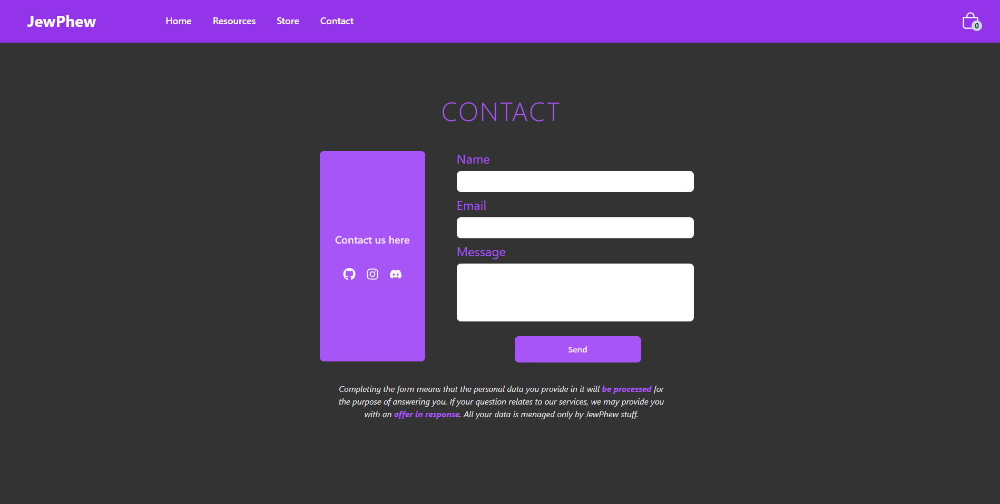

# 💎JewPhew

Main page view

Resources section view

Store section view

Used filter Gold in Store section

Used filter Silver in Store section

Used filter Diamond in Store section

Contact section view

Mobile navigation view

Empty cart view

Cart with product view

Footer section view

## Technologies

- **React+JS** for main web build
- **Module.css** & **TailwindCSS** for styling
- **Git** for controlling progress
- **Vite** for basic project config
- **Vercel** for web deployment
- **Firebase** for handling contact form data
- **React Icons** for nice icons
- **Toastify** for displaying cool errors

## What is User able to do?

- **Read** a lot of information about the properties of raw materials such as gold, silver and diamonds.
- **Browse** all the products offered by JewPhew and **filter** them by their material of manufacture.
- **Write** a message to the owner of JewPhew and **read** the visible and bold privacy policy regarding the processing of the data provided in the form.
- **Receive** a redirect to the JewPhew owner's accounts on github, instagram and discord.
- **Add** products to the shopping cart and **remove** them.

## 🚧Progress

✅Navbar
 
✅Home section
 
✅Resources section
 
✅Products section with filter option
 
✅Contact Section
 
✅Footer
 
✅RWD
 
✅Mobile menu
 
✅Connecting form submit with Firebase
 
✅/❌Cart

## 📈Information as of 19/10/2023

✅Fixed deployment error (package.json versions conflict)
